# sample-julia

Julia Sample for various isolation methods (containers, VMs).

## Overview

This project demonstrates how to set up a Julia development environment using different isolation methods:
- **Dev Containers** (Docker) - lightweight containerized development
- **DevPod** - open-source dev environments on any backend (Docker, Kubernetes, SSH, cloud)
- **Vagrant** (VirtualBox VM) - full virtual machine isolation

### Isolation Levels

| Environment | Isolation Level | Details |
|-------------|-----------------|---------|
| **DevContainer** | Medium | Runs in a Docker container, shares the host kernel, file system is isolated but mounts your project folder |
| **DevPod** | Medium-High | Uses Dev Container spec, but can run on remote backends (Kubernetes, cloud VMs) for higher isolation |
| **Vagrant/VirtualBox** | High | Full VM with its own kernel, hardware virtualization, stronger isolation from the host |

> **Note:** Both setups mount/sync your project directory into the guest environment for convenience. For true isolation (e.g., running untrusted code), you would need to remove the volume mount / synced folder and copy files instead.

## Prerequisites

### For Dev Containers
- [Docker](https://www.docker.com/get-started) installed and running
- [VS Code](https://code.visualstudio.com/) with the [Dev Containers extension](https://marketplace.visualstudio.com/items?itemName=ms-vscode-remote.remote-containers)

### For DevPod
- [DevPod](https://devpod.sh/) installed ([installation guide](https://devpod.sh/docs/getting-started/install))
- A provider configured (Docker, Kubernetes, SSH, or cloud provider)

### For Vagrant
- [VirtualBox](https://www.virtualbox.org/)
- [Vagrant](https://www.vagrantup.com/)

## Project Structure

```
.
├── .devcontainer/
│   ├── devcontainer.json    # Dev container configuration
│   └── Dockerfile           # Ubuntu 24.04 based image
├── .vscode/                 # VS Code settings
├── Project.toml             # Julia package manifest
├── src/
│   └── SampleJulia.jl      # Main module (greet, add, version)
├── test/
│   └── runtests.jl          # Unit tests
├── Vagrantfile              # Vagrant VM configuration
└── README.md
```

## Running the project

Clone the repository and open it in VS Code:

```sh
git clone https://github.com/s-celles/sample-julia.git
cd sample-julia
code .
```

### Dev Container (Docker)


1. Open the project in VS Code
2. When prompted, click "Reopen in Container" or use the command palette (`Ctrl+Shift+P`) and select "Dev Containers: Reopen in Container"
3. Wait for the container to build (first time may take a few minutes)

The container automatically installs dependencies and runs the project on startup.

#### Manual run

Open the terminal in VS Code (inside container) via `Terminal > New Terminal` (`Ctrl+Shift+``):

```sh
julia --project=. src/SampleJulia.jl
```

#### Running tests

```sh
julia --project=. -e 'using Pkg; Pkg.test()'
```

Or from the Julia REPL:

```julia
julia> ]
pkg> activate .
pkg> test
```

#### Dev Container Features

- **Base image:** Ubuntu 24.04 LTS (Noble Numbat)
- **Julia installation:** Via juliaup (devcontainer feature)
- **VS Code extensions:** Julia Language Support
- **Installed tools:** git, curl, build-essential

#### Container Lifecycle

The following diagram shows all possible container states and how to transition between them:

```mermaid
stateDiagram-v2
    [*] --> NoContainer: Project opened

    NoContainer --> Building: Reopen in Container
    Building --> Running: Build successful
    Building --> NoContainer: Build failed

    Running --> Stopped: Close VS Code / Stop Container
    Running --> Running: Rebuild Container
    Running --> NoContainer: Dev Containers Clean Up

    Stopped --> Running: Reopen in Container
    Stopped --> NoContainer: Dev Containers Clean Up

    note right of NoContainer
        No container exists
        .devcontainer/ config present
    end note

    note right of Building
        Docker builds image
        from Dockerfile
    end note

    note right of Running
        Container active
        VS Code connected
    end note

    note right of Stopped
        Container exists
        but not running
    end note
```



#### Dev Container Startup Sequence

What happens when you select "Reopen in Container":


#### Dev Container Development Workflow

Decision tree for common Dev Container operations:


#### Docker Commands Reference

| Command | Description |
|---------|-------------|
| `docker ps` | List running containers |
| `docker ps -a` | List all containers (including stopped) |
| `docker images` | List Docker images |
| `docker system prune` | Remove unused containers, networks, images |
| `docker logs <container>` | View container logs |

### DevPod

[DevPod](https://devpod.sh/) is an open-source tool that uses the Dev Container specification but allows running workspaces on any backend (Docker, Kubernetes, SSH remote machines, or cloud providers).

#### Using the DevPod CLI

1. Create and start a workspace from this repository:
```sh
devpod up https://github.com/s-celles/sample-julia
```

Or from a local directory:
```sh
devpod up .
```

2. Connect to the workspace via SSH:
```sh
devpod ssh sample-julia
```

3. Open in VS Code:
```sh
devpod up . --ide vscode
```

#### Using the DevPod Desktop App

1. Open DevPod Desktop
2. Click "Create Workspace"
3. Enter the repository URL or select a local folder
4. Choose your provider (Docker, Kubernetes, etc.)
5. Click "Create"

#### DevPod Commands Reference

| Command | Description |
|---------|-------------|
| `devpod up <source>` | Create and start a workspace |
| `devpod ssh <workspace>` | SSH into a workspace |
| `devpod stop <workspace>` | Stop a workspace |
| `devpod delete <workspace>` | Delete a workspace |
| `devpod list` | List all workspaces |
| `devpod provider list` | List configured providers |
| `devpod provider add <provider>` | Add a new provider |

#### DevPod Features

- **Uses existing Dev Container config:** No additional configuration needed
- **Multiple backends:** Run on Docker, Kubernetes, SSH, AWS, GCP, Azure, etc.
- **IDE integration:** Works with VS Code, JetBrains IDEs, and terminal
- **Prebuild support:** Speed up workspace creation with prebuilds
- **Open source:** Self-hosted, no vendor lock-in

#### Workspace Lifecycle

The following diagram shows all possible workspace states and how to transition between them:


#### DevPod Up Sequence

What happens when you run `devpod up`:


#### Development Workflow

Decision tree for common DevPod operations:


#### Troubleshooting

**Workspace fails to start**

Check provider status:
```sh
devpod provider list
```

Delete and recreate the workspace:
```sh
devpod delete <workspace> && devpod up <source>
```

**Cannot connect to workspace**

```sh
devpod ssh <workspace> --debug
```

### Vagrant (VirtualBox VM)

1. Start the virtual machine:
```sh
vagrant up
```

2. SSH into the VM:
```sh
vagrant ssh
```

3. Navigate to the project and run:
```sh
cd /home/vagrant/project
julia --project=. src/SampleJulia.jl
```

The VM automatically installs Julia (via juliaup) and runs the project during provisioning.

#### Manual run (inside VM)

```sh
cd /home/vagrant/project
julia --project=. -e 'using Pkg; Pkg.instantiate()'
julia --project=. src/SampleJulia.jl
```

#### Running tests (inside VM)

```sh
cd /home/vagrant/project
julia --project=. -e 'using Pkg; Pkg.test()'
```

#### Vagrant Commands

| Command | Description |
|---------|-------------|
| `vagrant up` | Start and provision the VM |
| `vagrant ssh` | Connect to the VM via SSH |
| `vagrant halt` | Stop the VM |
| `vagrant destroy` | Delete the VM |
| `vagrant reload` | Restart the VM |
| `vagrant provision` | Re-run provisioning scripts |

#### VM Lifecycle

The following diagram shows all possible VM states and the commands to transition between them:


#### Vagrant Up Sequence

What happens when you run `vagrant up`:


#### Development Workflow

Decision tree for common Vagrant operations:


#### Troubleshooting

**Julia not found after provisioning**

If provisioning didn't complete on first `vagrant up`, re-run it:
```sh
vagrant provision
```

Or start completely fresh:
```sh
vagrant destroy -f && vagrant up
```

**VM not responding or in a bad state**

```sh
vagrant reload --provision
```

#### Vagrant Features

- **Base box:** Ubuntu 24.04 LTS (Noble Numbat)
- **Memory:** 2 GB RAM
- **CPUs:** 2 cores
- **Synced folder:** Project mounted at `/home/vagrant/project`
- **Julia installation:** Via juliaup
- **Installed tools:** git, curl, build-essential

## Julia Commands Reference

| Command | Description |
|---------|-------------|
| `julia --project=. src/SampleJulia.jl` | Run the main module |
| `julia --project=. -e 'using Pkg; Pkg.test()'` | Run unit tests |
| `julia --project=. -e 'using Pkg; Pkg.instantiate()'` | Install dependencies |
| `julia --project=. -e 'using Pkg; Pkg.status()'` | Show installed packages |
| `julia --project=. -e 'using Pkg; Pkg.update()'` | Update dependencies |

## License

This project is licensed under the MIT License - see the [LICENSE](LICENSE) file for details.

## Want to contribute?

Feel free to open a PR with any suggestions for this test project!
